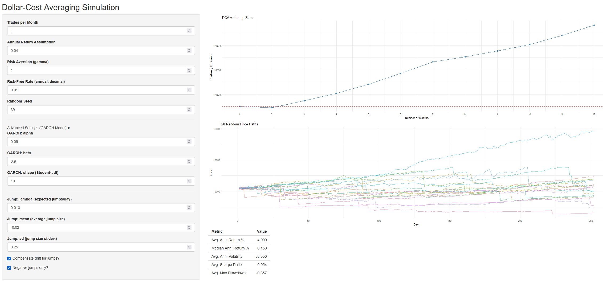

# DCA Simulator

This repository provides a Monte Carlo simulation framework for modeling S&P 500
price paths using GARCH(1,1) models with Student-t errors and jump processes.
The simulation is designed to analyze the performance of Dollar Cost Averaging
(DCA) investment strategies.

## Features
- Simulates S&P 500 price paths using GARCH(1,1) with Student-t errors
- Incorporates jump processes for rare, large price moves
- Flexible parameters for drift, volatility, jump frequency, and size
- Portfolio metrics: Sharpe ratio, drawdown, annualized return, and volatility
- Visualization of simulated price paths

## Example
Below is an example of the app in action:



## Getting Started

### Prerequisites
- R (version 4.3 or higher recommended)
- [rugarch](https://cran.r-project.org/web/packages/rugarch/index.html) package
- Other dependencies are managed via `renv`

### Installation
1. Clone this repository:
   ```sh
   git clone https://github.com/yourusername/dca_sim.git
   cd dca_sim
   ```
2. Open the project in RStudio (recommended) or your preferred R environment.
3. Restore the project environment:
   ```r
   renv::restore()
   ```

### Running the Simulation
Run the main simulation script:
```r
source('sim.R')
```

Or, to launch the Shiny app (if available):
```r
shiny::runApp('app.R')
```

## Files
- `sim.R`: Main simulation logic and functions
- `app.R`: Shiny app interface (if present)
- `example.png`: Example output of the app
- `renv/`, `renv.lock`: Project environment management
